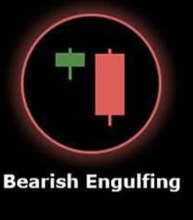

# Bearish Engulfing 🐻

## Description
A **Bearish Engulfing** is a powerful two-candle reversal pattern that signals a potential shift from bullish to bearish sentiment. The second candle completely engulfs the body of the previous bullish candle, showing strong selling pressure.

## Characteristics
- **First candle**: Bullish (green) with a substantial body
- **Second candle**: Bearish (red) that opens above the previous close
- **Complete engulfment**: Second candle's body completely covers the first candle's body
- **Significant size difference**: Second candle should be at least 20% larger than the first

## Market Signal
This pattern demonstrates a dramatic shift in market sentiment. The first candle shows bullish control, but the second candle's strong bearish move that engulfs the previous day's gains indicates that sellers have overwhelmed buyers and taken control of the market.

## Trading Implications
When detected in your 15-minute analysis, the Bearish Engulfing pattern suggests strong potential for downward price movement. It's considered one of the most reliable bearish reversal signals, especially when it appears after an uptrend.

