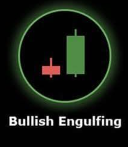

# Bullish Engulfing 🐂

## Description
A **Bullish Engulfing** is a powerful two-candle reversal pattern that signals a potential shift from bearish to bullish sentiment. The second candle completely engulfs the body of the previous bearish candle, showing strong buying pressure.

## Characteristics
- **First candle**: Bearish (red) with a substantial body
- **Second candle**: Bullish (green) that opens below the previous close
- **Complete engulfment**: Second candle's body completely covers the first candle's body
- **Significant size difference**: Second candle should be at least 20% larger than the first

## Market Signal
This pattern demonstrates a dramatic shift in market sentiment. The first candle shows bearish control, but the second candle's strong bullish move that engulfs the previous day's losses indicates that buyers have overwhelmed sellers and taken control of the market.

## Trading Implications
When detected in your 15-minute analysis, the Bullish Engulfing pattern suggests strong potential for upward price movement. It's considered one of the most reliable bullish reversal signals, especially when it appears after a downtrend.

