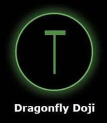

# Dragonfly Doji 🐉

## Description
A **Dragonfly Doji** is a bullish reversal candlestick pattern that typically appears at market bottoms. It forms when the opening and closing prices are nearly identical at the high of the trading session, creating a very small body with a long lower shadow resembling a dragonfly.

## Characteristics
- **Very small body** (less than 10% of total range)
- **Long lower shadow** (over 60% of total range)
- **Little to no upper shadow** (less than 10% of total range)
- Opening and closing prices are nearly the same at session highs

## Market Signal
This pattern shows that sellers drove prices significantly lower during the session, but buyers stepped in with strong demand and pushed prices back up to near the opening level. The long lower shadow demonstrates strong support and buying interest at lower levels.

## Trading Implications
When detected in your 15-minute analysis, the Dragonfly Doji suggests potential upward price movement. It indicates that bears attempted to push lower but failed, showing possible bullish momentum building.

