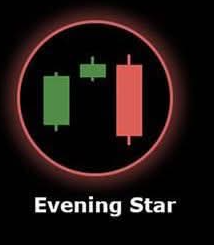

# Evening Star 🌙

## Description
An **Evening Star** is a powerful three-candle bearish reversal pattern that typically appears at the top of an uptrend. It signals the end of bullish momentum and the potential beginning of a bearish trend.

## Characteristics
- **First candle**: Large bullish (green) candle showing continued uptrend
- **Second candle**: Small body (doji or spinning top) indicating indecision
- **Third candle**: Large bearish (red) candle that closes below the midpoint of the first candle
- **Gap up**: Second candle often gaps up from the first
- **Strong reversal**: Third candle shows decisive bearish momentum

## Market Signal
This pattern represents a transition from bullish to bearish sentiment over three periods. The first candle confirms the uptrend, the second shows uncertainty and potential exhaustion of buying pressure, and the third candle demonstrates that sellers have taken control.

## Trading Implications
When detected in your 15-minute analysis, the Evening Star is one of the strongest bearish reversal signals. It suggests significant potential for downward price movement and is often used as a signal to enter short positions or exit long positions.

