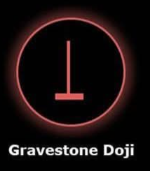

# Gravestone Doji 🪦

## Description
A **Gravestone Doji** is a bearish reversal candlestick pattern that appears at market tops. It forms when the opening and closing prices are nearly identical at the low of the trading session, creating a very small body with a long upper shadow resembling a gravestone.

## Characteristics
- **Very small body** (less than 10% of total range)
- **Long upper shadow** (over 60% of total range)
- **Little to no lower shadow** (less than 10% of total range)
- Opening and closing prices are nearly the same at session lows

## Market Signal
This pattern indicates that buyers pushed prices significantly higher during the session, but sellers regained control and drove prices back down to near the opening level. The long upper shadow shows rejection of higher prices and potential selling pressure.

## Trading Implications
When detected in your 15-minute analysis, the Gravestone Doji suggests potential downward price movement. It signals that bulls attempted to push higher but failed, indicating possible bearish momentum ahead.

