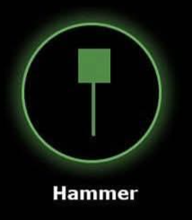

# Hammer 🔨

## Description
A **Hammer** is a bullish reversal candlestick pattern that typically appears at the bottom of a downtrend. It indicates a potential change from bearish to bullish sentiment. The pattern gets its name from its visual appearance, resembling a hammer with a long handle.

## Characteristics
- **Small body** at the upper end of the trading range
- **Long lower shadow** (at least 2x the body size)
- **Little to no upper shadow** (less than 0.5x the body size)
- Body can be either bullish (green) or bearish (red)

## Market Signal
This pattern suggests that sellers drove the price significantly lower during the session, but buyers stepped in and pushed the price back up near the opening level. The long lower shadow indicates strong buying pressure at lower levels, potentially signaling a trend reversal.

## Trading Implications
When detected in your 15-minute analysis, the Hammer suggests potential upward price movement in the short term. Traders often look for confirmation in subsequent candles before entering long positions.

