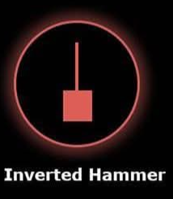

# Inverted Hammer 🔨

## Description
An **Inverted Hammer** is a bearish reversal candlestick pattern that appears at market tops. Despite its bullish-looking long upper shadow, it actually signals potential downward movement when found at resistance levels or after an uptrend.

## Characteristics
- **Small body** at the lower end of the trading range
- **Long upper shadow** (at least 2x the body size)
- **Little to no lower shadow** (less than 0.5x the body size)
- Body can be either bullish (green) or bearish (red)

## Market Signal
This pattern indicates that buyers pushed prices significantly higher during the session, but sellers regained control and drove prices back down near the opening level. The long upper shadow shows rejection of higher prices and potential distribution by institutional investors.

## Trading Implications
When detected in your 15-minute analysis, the Inverted Hammer suggests potential downward price movement in the short term. It signals that bulls attempted to drive prices higher but failed to maintain those levels, indicating possible bearish momentum.

