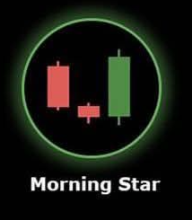

# Morning Star 🌟

## Description
A **Morning Star** is a powerful three-candle bullish reversal pattern that typically appears at the bottom of a downtrend. It signals the end of bearish momentum and the potential beginning of a bullish trend.

## Characteristics
- **First candle**: Large bearish (red) candle showing continued downtrend
- **Second candle**: Small body (doji or spinning top) indicating indecision
- **Third candle**: Large bullish (green) candle that closes above the midpoint of the first candle
- **Gap down**: Second candle often gaps down from the first
- **Strong reversal**: Third candle shows decisive bullish momentum

## Market Signal
This pattern represents a transition from bearish to bullish sentiment over three periods. The first candle confirms the downtrend, the second shows uncertainty and potential exhaustion of selling pressure, and the third candle demonstrates that buyers have taken control.

## Trading Implications
When detected in your 15-minute analysis, the Morning Star is one of the strongest bullish reversal signals. It suggests significant potential for upward price movement and is often used as a signal to enter long positions or exit short positions.

