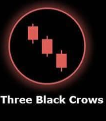

# Three Black Crows ⚫

## Description
**Three Black Crows** is a strong bearish continuation pattern consisting of three consecutive long bearish candles. This pattern indicates sustained selling pressure and strong downward momentum in the market.

## Characteristics
- **Three consecutive bearish candles** with substantial bodies
- **Progressive lower closes**: Each candle closes lower than the previous
- **Progressive lower opens**: Each candle opens lower than the previous candle's open
- **Minimal shadows**: All three candles should have relatively small upper and lower shadows
- **Steady decline**: Each candle should advance the downward trend progressively

## Market Signal
This pattern demonstrates sustained and determined selling pressure over three consecutive periods. It shows that sellers are in firm control of the market and are willing to accept progressively lower prices, indicating strong bearish momentum that is likely to continue.

## Trading Implications
When detected in your 15-minute analysis, Three Black Crows suggests strong continued downward price movement. It's particularly powerful when it appears after a period of consolidation or at the beginning of a new downtrend, signaling robust bearish momentum.

