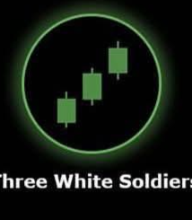

# Three White Soldiers ⚪

## Description
**Three White Soldiers** is a strong bullish continuation pattern consisting of three consecutive long bullish candles. This pattern indicates sustained buying pressure and strong upward momentum in the market.

## Characteristics
- **Three consecutive bullish candles** with substantial bodies
- **Progressive higher closes**: Each candle closes higher than the previous
- **Progressive higher opens**: Each candle opens higher than the previous candle's open
- **Minimal shadows**: All three candles should have relatively small upper and lower shadows
- **Steady advancement**: Each candle should advance the trend progressively

## Market Signal
This pattern demonstrates sustained and determined buying pressure over three consecutive periods. It shows that buyers are in firm control of the market and are willing to pay progressively higher prices, indicating strong bullish momentum that is likely to continue.

## Trading Implications
When detected in your 15-minute analysis, Three White Soldiers suggests strong continued upward price movement. It's particularly powerful when it appears after a period of consolidation or at the beginning of a new uptrend, signaling robust bullish momentum.

