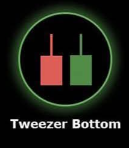

# Tweezer Bottom 🤏

## Description
A **Tweezer Bottom** is a bullish reversal pattern formed by two consecutive candles with nearly identical lows. This pattern suggests that the market has reached a support level and may reverse direction upward.

## Characteristics
- **Two consecutive candles** with similar low prices (within 0.5% tolerance)
- **First candle**: Typically bearish (red)
- **Second candle**: Typically bullish (green)
- **Similar lows**: Both candles test the same support level but fail to break below

## Market Signal
This pattern indicates that sellers attempted to push prices lower on two separate occasions but were met with strong support at the same level. The failure to break through this support suggests that buying pressure is building and an upward reversal may be imminent.

## Trading Implications
When detected in your 15-minute analysis, the Tweezer Bottom suggests potential upward price movement. It signals that the current support level is strong and sellers are losing momentum, making it a good signal for potential long positions.

