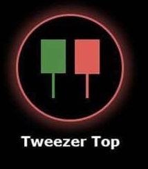

# Tweezer Top 🤏

## Description
A **Tweezer Top** is a bearish reversal pattern formed by two consecutive candles with nearly identical highs. This pattern suggests that the market has reached a resistance level and may reverse direction downward.

## Characteristics
- **Two consecutive candles** with similar high prices (within 0.5% tolerance)
- **First candle**: Typically bullish (green)
- **Second candle**: Typically bearish (red)
- **Similar highs**: Both candles test the same resistance level but fail to break through

## Market Signal
This pattern indicates that buyers attempted to push prices higher on two separate occasions but were met with strong resistance at the same level. The failure to break through this resistance suggests that selling pressure is building and a downward reversal may be imminent.

## Trading Implications
When detected in your 15-minute analysis, the Tweezer Top suggests potential downward price movement. It signals that the current resistance level is strong and buyers are losing momentum, making it a good signal for potential short positions.

